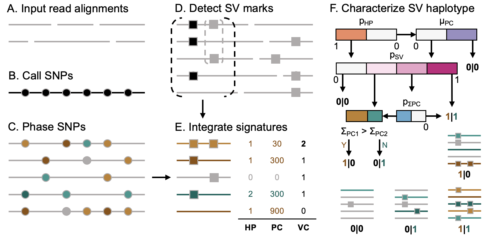

## Duet: SNP-Assisted SV Calling, Genotyping, and Phasing Using Low-depth Oxford Nanopore Sequencing Data

[](https://anaconda.org/bioconda/duet)
[](https://anaconda.org/bioconda/duet)
[](https://anaconda.org/bioconda/duet)
[](https://anaconda.org/bioconda/duet)
[](https://anaconda.org/bioconda/duet)
[](https://anaconda.org/bioconda/duet)

---
### Introduction

Low-depth whole genome sequencing (WGS) using the long-read Oxford Nanopore Technologies (ONT) MinION sequencer provides a cost-effective option for highly sensitive and well-resolved structural variant (SV) detection, enabling practicable clinical applications for routine genetic screening. Despite the advantage of using long reads alignment, especially along repetitive genomic regions, precise (1) SV calling, (2) SV genotyping and (3) SV phasing using the existing workflows with low-coverage data is still challenging. Here we introduce Duet, an SV caller that utilizes 7 novel features derived from read-based SV and Single-nucleotide polymorphism (SNP) signatures to boost the performance of SV genotyping and phasing. The application requires minimal computational resources, and the decision path is interpretable. Precise SV genotyping and phasing also works as an effective filter to remove false positives from the SV caller to improve the overall precision. 

---
### Overview



Steps (A) to (F) illustrate the workflow of Duet. (A) First, ONT long reads are aligned using Minimap2. (B-C) To obtain the per-read phasing information (green or brown) with its confidence level (luminance of the color), SNP (indicated in circles) calling is performed using Clair3 and phased using WhatsHap. (D-E) Seven novel features are extracted and integrated with SV marks (indicated in squares), detected using optimized SVIM. (F) The classification of SV genotype and haplotype is done using a rule-based decision tree.

---
### Installation

```shell
# install via conda
$ conda create -n duet -c bioconda duet -y && conda activate duet

# or you can install from github
$ conda config --add channels bioconda && conda config --add channels conda-forge
$ conda create -n duet -c bioconda svim=1.4.2 clair3=0.1.5 bcftools=1.8 -y && conda activate duet
$ git clone https://github.com/yekaizhou/duet.git
$ cd duet && pip install .

$ duet -h
```

---
### Dependencies

- [clair3](https://github.com/HKU-BAL/Clair3) = 0.1.5
- [svim](https://github.com/eldariont/svim) = 1.4.2
- [bcftools](https://anaconda.org/bioconda/bcftools) = 1.8

---
### Usage

    duet <ALN.bam>     # along with indexed .bai file in the same directory \
         <REF.fa>      # along with indexed .fai file in the same directory \
         <OUTPUT_DIR>  # working and output directory
         [Optional Parameters]

| Optional Parameter | Description | Default |
| :------------ |:---------------|-------------:|
|--threads, -t|number of threads to use|40|
|--min_allele_frequency, -m|minimum allele frequency required to call a candidate SNP|0.25|
|--cluster_max_distance, -c|maximum span-position distance between SV marks in a cluster to call a SV candidates|0.9|
|--sv_min_size, -s|minimum SV size to be reported|50|
|--min_support_read, -r|minimum number of reads that support a SV to be reported|2|

---
### Output
   
| Chromosome | Position | ID | Alteration | Length | Haplotype | Phase Set |
|:---:|:---:|:---:|:---:|:---:|:---:|:---:|
|1|724801|Duet.1|INS|1963|**1\|1**|639244|
|1|818028|Duet.2|DEL|-84|**0\|1**|639244|
|1|965596|Duet.3|DEL|-353|**1\|0**|639244|
|...|...|...|...|...|**...**|...|
|16|88087453|Duet.6700|INS|142|**0\|1**|85189772|
|16|88196792|Duet.6701|DEL|-131|**1\|1**|85189772|
|...|...|...|...|...|**...**|...|
    
These SV phasing results will be arranged into `phased_sv.vcf`. Results from intermediate steps (SNP calling, SNP phasing, SV calling) will also be written to corresponding folders in the same working directory, for the reference and utilization of the users.

---
### Quick demo

After [Installation](#installation), Duet can be used for phased SV detection. Here we demonstrate the utility of Duet using a lite example: **chromosome 21** in the **HG00733** human sample, aligning to the **hg19** reference genome.

```bash
mkdir duet_demo && cd duet_demo
wget 'http://www.bio8.cs.hku.hk/duet_demo_data.tar.gz'
tar -zxvf duet_demo_data.tar.gz && rm duet_demo_data.tar.gz
duet duet_demo_data/HG00733_hg19_chr21.bam duet_demo_data/hg19_chr21.fa results

less results/phased_sv.vcf
```

---
### Contact

For any problems or suggestions, please post on [Github Issue](https://github.com/yekaizhou/duet/issues) or send to yekai.zhou@outlook.com.
