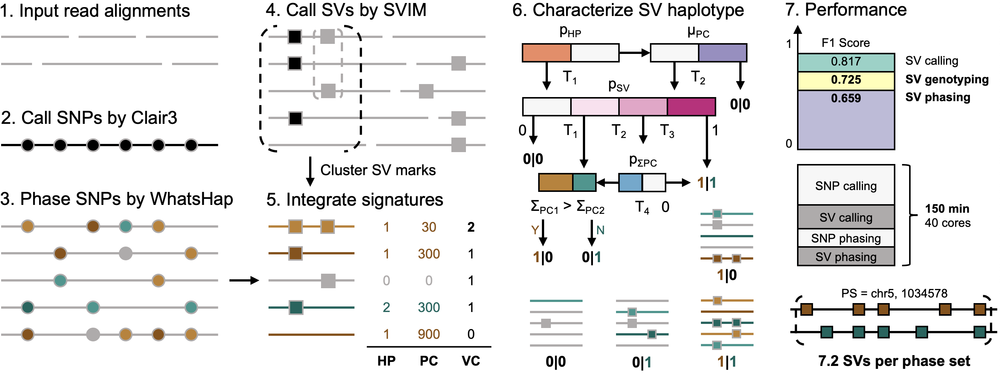

## Duet: SNP-Assisted Phased SV Detection from Low-depth Long-reads

[](https://anaconda.org/bioconda/duet)
[](https://anaconda.org/bioconda/duet)
[](https://anaconda.org/bioconda/duet)
[](https://anaconda.org/bioconda/duet)
[](https://anaconda.org/bioconda/duet)
[](https://anaconda.org/bioconda/duet)

---
### Introduction

In clinical applications and population studies, an ideal structural variation (SV) identifier will detect SV positions and characterize corresponding haplotypes in high precision, relying on limited sequencing resources per sample. Available SV callers can recognize SV spots sensitively from low-depth long-reads, but the subsequent haplotype characterization remains underdeveloped. Here we present Duet, a tool for phased SV detection from low-depth long-reads. Duet abstracts signatures from both small and large variants into a unified, comprehensive while interpretable SV haplotype characterization framework, to achieve fast and accurate SV calling, genotyping, and phasing in one command. Benchmarks on long-read sequencing datasets from three samples demonstrate the above uniqueness and superiority.

---
### Graphical Abstract



Step (A) to (F) is the workflow, and (G) is corresponding performance. Grey and black lines are sequencing alignments and reference sequences. Circles and squares represent SNPs and SVs. Squares with grey and black edges stand for initial SV marks and final SV calls. Different colors (brown and green) in dots and lines denote different haplotypes of the reads and the variants (grey line means unphasable read). Luminance of the color demonstrates the confidence of the haplotype prediction. The abstracted SV haplotyping algorithm with example SV candidates and their prediction results in step (F) is demonstrated in Figure 3. Parameters in step (E) and (F) are illustrated in Table 1. The performance indicated in (G) is tested in the combined SV call set for three 8X ONT data sets from HG00733, HG001,and HG002 human samples. “T” and “T” with subscript are thresholds.

---
### Installation

```shell
# install via conda
$ conda create -n duet -c bioconda duet -y && conda activate duet

# install from github
$ conda config --add channels bioconda && conda config --add channels conda-forge
$ conda create -n duet -c bioconda svim=1.4.2 clair3=0.1.5 bcftools=1.8 -y && conda activate duet
$ git clone https://github.com/yekaizhou/duet.git
$ cd duet && pip install .

$ duet -h
```

---
### Dependencies

- [clair3](https://github.com/HKU-BAL/Clair3) = 0.1.5
- [svim](https://github.com/eldariont/svim) = 1.4.2
- [bcftools](https://anaconda.org/bioconda/bcftools) = 1.8

---
### Usage

    duet <ALN.bam>     # along with indexed .bai file in the same directory \
         <REF.fa>      # along with indexed .bai file in the same directory \
         <OUTPUT_DIR>  # working and output directory
         [Optional Parameters]

| Optional Parameter | Description | Default |
| :------------ |:---------------|-------------:|
|--threads, -t|number of threads to use|40|
|--min_allele_frequency, -m|minimum allele frequency required to call a candidate SNP|0.25|
|--cluster_max_distance, -c|maximum span-position distance between SV marks in a cluster to call a SV candidates|0.9|
|--sv_min_size, -s|minimum SV size to be reported|50|
|--min_support_read, -r|minimum number of reads that support a SV to be reported|2|

---
### Output
   
| Chromosome | Position | ID | Alteration | Length | Haplotype | Phase Set |
|:---:|:---:|:---:|:---:|:---:|:---:|:---:|
|1|724801|Duet.1|INS|1963|**1\|1**|639244|
|1|818028|Duet.2|DEL|-84|**0\|1**|639244|
|1|965596|Duet.3|DEL|-353|**1\|0**|639244|
|...|...|...|...|...|**...**|...|
|16|88087453|Duet.6700|INS|142|**0\|1**|85189772|
|16|88196792|Duet.6701|DEL|-131|**1\|1**|85189772|
|...|...|...|...|...|**...**|...|
    
These SV phasing results will be arranged into `phased_sv.vcf`. Results from intermediate steps (SNP calling, SNP phasing, SV calling) will also be written to corresponding folders in the same working directory, for the reference and utilization of the users.

---
### Contact

For any problems or suggestions during the use of duet, please post on [Github Issue](https://github.com/yekaizhou/duet/issues) or contact yekai.zhou@outlook.com.
