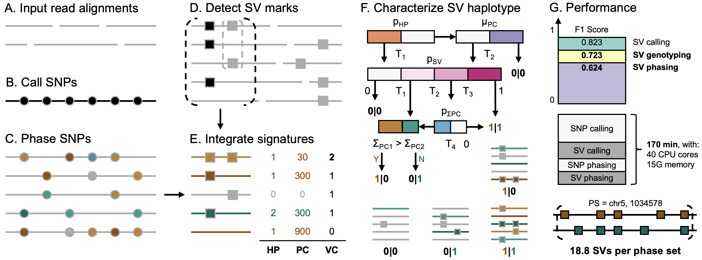
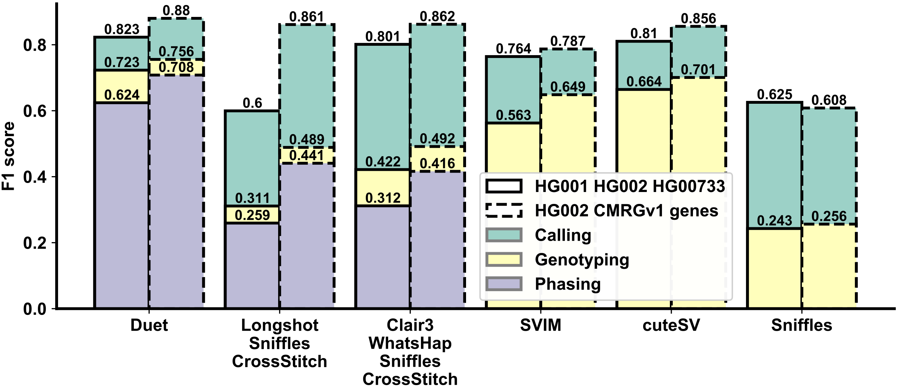

## Duet: SNP-Assisted SV Calling and Phasing Using Low-depth Long-reads

[](https://anaconda.org/bioconda/duet)
[](https://anaconda.org/bioconda/duet)
[](https://anaconda.org/bioconda/duet)
[](https://anaconda.org/bioconda/duet)
[](https://anaconda.org/bioconda/duet)
[](https://anaconda.org/bioconda/duet)

---
### Introduction

Accurate calling and phasing of structural variations (SVs) are important to human genetics and medicine. However, available SV detectors have constraints in SV phasing. Here we present Duet, a long-read SV detector that can call and phase SVs using the potentials from both small and large variants. Duet is efficient and accurate even when using low-depth sequencing, benchmarked against available and feasible approaches.

---
### Overview



Step (A) to (F) is the workflow, and (G) is the performance of Duet. Grey and black lines are sequencing alignments and reference sequences. Circles and squares are SNPs and SVs. Squares with grey and black edges are initial SV marks and final SV calls. Different colors (brown and green) in dots and lines are different haplotypes of the reads and the variants (grey line means unphasable read). The luminance of the color represents the confidence of the haplotype prediction. The abstracted SV haplotyping algorithm with example SV candidates and their prediction results in step (F) is illustrated in Figure 4. Parameters in steps (E, F) are demonstrated in Table 1. (G) is the average performance tested on three 8X ONT data sets from HG00733, HG001, and HG002 human samples. “T” and “T” with subscripts are thresholds.

---
### Benchmark



Benchmark Duet against SV detectors and SV phasing pipelines. Rectangles with solid edges represent the average performance on 8X ONT of HG001, HG002, and HG00733 human samples. Rectangles with dotted edges represent performance on HG002 8X ONT restricted to CMRG genes. The highest performance for SV calling, genotyping, and phasing in each benchmark test will be marked an asterisk. 

---
### Installation

```shell
# install via conda
$ conda create -n duet -c bioconda duet -y && conda activate duet

# install from github
$ conda config --add channels bioconda && conda config --add channels conda-forge
$ conda create -n duet -c bioconda svim=1.4.2 clair3=0.1.5 bcftools=1.8 -y && conda activate duet
$ git clone https://github.com/yekaizhou/duet.git
$ cd duet && pip install .

$ duet -h
```

---
### Dependencies

- [clair3](https://github.com/HKU-BAL/Clair3) = 0.1.5
- [svim](https://github.com/eldariont/svim) = 1.4.2
- [bcftools](https://anaconda.org/bioconda/bcftools) = 1.8

---
### Usage

    duet <ALN.bam>     # along with indexed .bai file in the same directory \
         <REF.fa>      # along with indexed .fai file in the same directory \
         <OUTPUT_DIR>  # working and output directory
         [Optional Parameters]

| Optional Parameter | Description | Default |
| :------------ |:---------------|-------------:|
|--threads, -t|number of threads to use|40|
|--min_allele_frequency, -m|minimum allele frequency required to call a candidate SNP|0.25|
|--cluster_max_distance, -c|maximum span-position distance between SV marks in a cluster to call a SV candidates|0.9|
|--sv_min_size, -s|minimum SV size to be reported|50|
|--min_support_read, -r|minimum number of reads that support a SV to be reported|2|

---
### Output
   
| Chromosome | Position | ID | Alteration | Length | Haplotype | Phase Set |
|:---:|:---:|:---:|:---:|:---:|:---:|:---:|
|1|724801|Duet.1|INS|1963|**1\|1**|639244|
|1|818028|Duet.2|DEL|-84|**0\|1**|639244|
|1|965596|Duet.3|DEL|-353|**1\|0**|639244|
|...|...|...|...|...|**...**|...|
|16|88087453|Duet.6700|INS|142|**0\|1**|85189772|
|16|88196792|Duet.6701|DEL|-131|**1\|1**|85189772|
|...|...|...|...|...|**...**|...|
    
These SV phasing results will be arranged into `phased_sv.vcf`. Results from intermediate steps (SNP calling, SNP phasing, SV calling) will also be written to corresponding folders in the same working directory, for the reference and utilization of the users.

---
### Quick demo

After [Installation](#installation), Duet can be used for phased SV detection. Here we demonstrate the utility of Duet using a lite example: **chromosome 21** in the **HG00733** human sample, aligning to the **hg19** reference genome.

```bash
mkdir duet_demo && cd duet_demo
wget 'http://www.bio8.cs.hku.hk/duet_demo_data.tar.gz'
tar -zxvf duet_demo_data.tar.gz && rm duet_demo_data.tar.gz
duet duet_demo_data/HG00733_hg19_chr21.bam duet_demo_data/hg19_chr21.fa results

less results/phased_sv.vcf
```

---
### Contact

For any problems or suggestions regarding _Duet_, please post on [Github Issue](https://github.com/yekaizhou/mppi/issues) or send to yekai.zhou@outlook.com.
