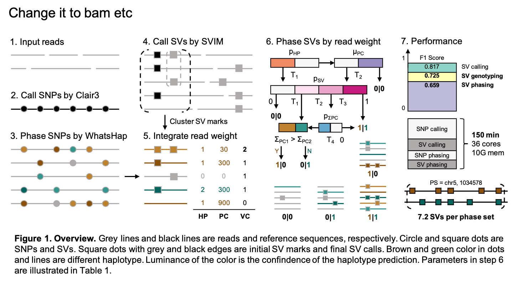

# Duet

Duet is used for the calling and haplotyping of novel structural variations from low-depth Oxford Nanopore sequencing. The algorithm employs the power of called SNPs from the same reads, to achieve high accuracy in SV genotyping and haplotyping, while maintains fast speed.

Below is the graphical abstract of the overview of Duet.

---
## Installation

    # install via conda
    $ conda create -n duet_env -c bioconda duet && conda activate duet_env
    $ duet -h

    # install from github
    $ conda config --add channels bioconda && conda config --add channels conda-forge
    $ conda create -n duet_env -c bioconda -c conda-forge svim=1.4.2 clair3=0.1.5 bcftools=1.8 -y && conda activate duet_env
    $ git clone https://github.com/yekaizhou/duet.git && cd duet/src/duet
    $ python duet -h

---
## Dependencies

- [clair3](https://github.com/HKU-BAL/Clair3) = 0.1.5
- [svim](https://github.com/eldariont/svim) = 1.4.2
- [bcftools](https://anaconda.org/bioconda/bcftools) = 1.8

---
## Usage

    duet <ALN.bam>     # along with indexed .bai file in the same directory \
         <REF.fa>      # along with indexed .bai file in the same directory \
         <OUTPUT_DIR>  # working and output directory

| Optional Parameter | Description | Default |
| :------------ |:---------------|-------------:|
|--threads, -t|number of threads to use|40|
|--min_allele_frequency, -m|minimum allele frequency required to call a candidate SNP|0.25|
|--cluster_max_distance, -c|maximum span-position distance between SV marks in a cluster to call a SV candidates|0.9|
|--sv_min_size, -s|minimum SV size to be reported|50|
|--min_support_read, -r|minimum number of reads that support a SV to be reported|2|

---
## Contact
For any problems or suggestions during the use of duet, please post on [Github Issue](https://github.com/yekaizhou/duet/issues) or contact yekai.zhou@outlook.com.
