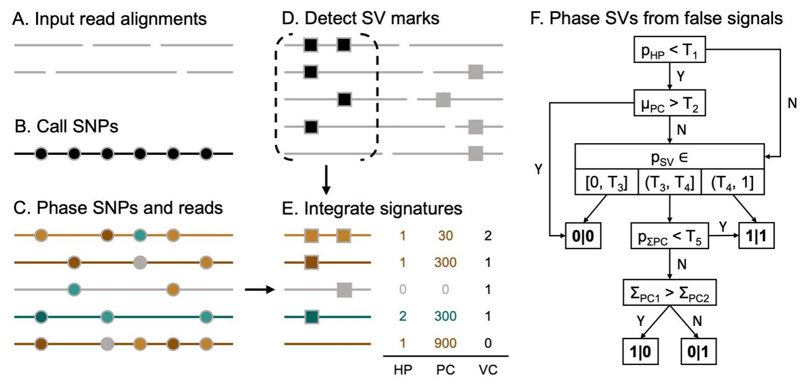

## Duet: SNP-Assisted Structural Variant Calling and Phasing Using Oxford Nanopore Sequencing

[](https://anaconda.org/bioconda/duet)
[](https://anaconda.org/bioconda/duet)
[](https://anaconda.org/bioconda/duet)
[](https://anaconda.org/bioconda/duet)
[](https://anaconda.org/bioconda/duet)
[](https://anaconda.org/bioconda/duet)

---
### Introduction

Whole genome sequencing (WGS) using the long-read Oxford Nanopore Technologies (ONT) MinION sequencer provides a cost-effective option for structural variant (SV) detection in clinical applications. Despite the advantage of using long reads, however, accurate SV calling and phasing are still challenging. We introduce Duet, an SV detection tool optimized for SV calling and phasing using ONT data. The tool uses novel features integrated from both SV signatures and single-nucleotide polymorphism (SNP) signatures, which can accurately distinguish SV haplotype from a false signal. Duet can perform accurate SV calling, SV genotyping and SV phasing using low-coverage ONT data. It has great scaling performance when sequencing coverage is higher and is adaptable to various clinical applications.

---
### Overview



(A) First, ONT long reads are aligned using Minimap2. (B-C) To obtain the per-read phasing information (green or brown) with its confidence level (luminance of the color), SNPs (indicated in circles) are called using Clair3 and then phased using WhatsHap. Based on the phased SNPs, the haplotypes of the reads are determined by WhatsHap. (D) The SV marks on each read are detected by cuteSV. (E) Three signatures from previous steps are integrated as the signature of the support reads. (F) Duet phases SV and filters out false signals based on the features derived from the signatures in step (E). T1 to T5 are thresholds for each feature.

---
### Installation

```shell
# install via conda
conda config --add channels bioconda && conda config --add channels conda-forge
conda create -n duet -c bioconda duet -y && conda activate duet

# or you can install from github
conda config --add channels bioconda && conda config --add channels conda-forge
conda create -n duet -c bioconda svim=1.4.2 clair3=0.1.11 bcftools=1.8 -y && conda activate duet
git clone https://github.com/yekaizhou/duet.git
cd duet && pip install .

duet -h
```

---
### Dependencies

- [clair3](https://github.com/HKU-BAL/Clair3) = 0.1.11
- [svim](https://github.com/eldariont/svim) = 1.4.2
- [cutesv](https://github.com/tjiangHIT/cuteSV) = 1.0.13
- [bcftools](https://anaconda.org/bioconda/bcftools) = 1.8

---
### Usage

    duet <ALN.bam>     # along with indexed .bai file in the same directory \
         <REF.fa>      # along with indexed .fai file in the same directory \
         <OUTPUT_DIR>  # working and output directory
         [Optional Parameters]

| Optional Parameter | Description | Default |
| :------------ |:---------------|-------------:|
|--threads, -t|number of threads to use|4|
|--include_all_ctgs, -a|call variants on all contigs, otherwise chr{1..22,X,Y}|false|
|--sv_min_size, -s|minimum SV size to be reported|50|
|--min_allele_frequency, -m|minimum allele frequency required to call a candidate SNP|0.25|
|--min_support_read, -r|minimum number of reads that support a SV to be reported|2|
|--sv_caller, -b|choose the base SV caller from either cuteSV ("cutesv") or SVIM ("svim")|cutesv|
|--cluster_max_distance, -c|maximum span-position distance between SV marks in a cluster to call a SV candidates when using SVIM as the base SV caller|0.9|

---
### Output
   
| Chromosome | Position | ID | Alteration | Length | Haplotype | Phase Set |
|:---:|:---:|:---:|:---:|:---:|:---:|:---:|
|1|724801|Duet.1|INS|1963|**1\|1**|639244|
|1|818028|Duet.2|DEL|-84|**0\|1**|639244|
|1|965596|Duet.3|DEL|-353|**1\|0**|639244|
|...|...|...|...|...|**...**|...|
|16|88087453|Duet.6700|INS|142|**0\|1**|85189772|
|16|88196792|Duet.6701|DEL|-131|**1\|1**|85189772|
|...|...|...|...|...|**...**|...|
    
These SV phasing results will be arranged into `phased_sv.vcf`. Results from intermediate steps (SNP calling, SNP phasing, SV calling) will also be written to corresponding folders in the same working directory, for the reference and utilization of the users.

---
### Quick demo

After [Installation](#installation), Duet can be used for phased SV detection. Here we demonstrate the utility of Duet using a lite example: **chromosome 21** in the **HG00733** human sample, aligning to the **hg19** reference genome.

```bash
mkdir duet_demo && cd duet_demo
wget 'http://www.bio8.cs.hku.hk/duet_demo_data.tar.gz'
tar -zxvf duet_demo_data.tar.gz && rm duet_demo_data.tar.gz
duet duet_demo_data/HG00733_hg19_chr21.bam duet_demo_data/hg19_chr21.fa results

less results/phased_sv.vcf
```

---
### Contact

For any problems or suggestions, please post on [Github Issue](https://github.com/yekaizhou/duet/issues) or send to yekai.zhou@outlook.com.
